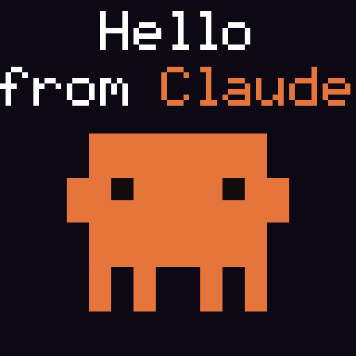

<div align="center">
  
  <h1>@cyanheads/pixoo-mcp-server</h1>
  <p><b>Your Pixoo, programmable via LLM</b></p>
  <p>Compose and push pixel art, animations, and text to Divoom Pixoo LED matrices via MCP.</p>
  <div>4 Tools · STDIO & Streamable HTTP</div>
</div>

<div align="center">

[](./CHANGELOG.md) [](https://github.com/modelcontextprotocol/modelcontextprotocol/blob/main/docs/specification/2025-11-25/changelog.mdx) [](./LICENSE) [](https://www.typescriptlang.org/) [](https://bun.sh/)

</div>

---

## 🛠️ Tools Overview

This server provides 4 tools for composing and pushing visual content to Pixoo displays:

| Tool                   | Description                                                                                                                                                           | Annotations       |
| :--------------------- | :-------------------------------------------------------------------------------------------------------------------------------------------------------------------- | :---------------- |
| **`pixoo_compose`**    | Compose a scene from layered elements (text, images, sprites, shapes, bitmaps, pixels) and push to device. Supports multi-frame animation with per-element keyframes. | `destructiveHint` |
| **`pixoo_push_image`** | Load a single image file (PNG, JPEG, WebP, GIF, AVIF, TIFF, SVG), resize to the display grid, and push to the device.                                                 | `destructiveHint` |
| **`pixoo_text`**       | Push native on-device scrolling text overlay via the device's built-in fonts. Overlays persist across channel switches.                                               | `destructiveHint` |
| **`pixoo_control`**    | Read or change device settings (brightness, channel, screen on/off, clock face). Call with no parameters to read config.                                              | `idempotentHint`  |

Both `pixoo_compose` and `pixoo_push_image` auto-switch the device to the `custom` channel before pushing.

## 🚀 Getting Started

### MCP Client Settings

Add the following to your MCP client configuration file (e.g., `claude_desktop_config.json`). Clients have different ways to configure servers, so refer to your client's documentation for specifics.

**Be sure to set `PIXOO_IP` to the IP address of your Pixoo device on the local network.**

#### Claude Code

```bash
claude mcp add pixoo-mcp-server -e PIXOO_IP=YOUR_DEVICE_IP -- bunx @cyanheads/pixoo-mcp-server@latest
```

#### Using bunx (Bun)

```json
{
  "mcpServers": {
    "pixoo-mcp-server": {
      "type": "stdio",
      "command": "bunx",
      "args": ["@cyanheads/pixoo-mcp-server@latest"],
      "env": {
        "PIXOO_IP": "192.168.1.100",
        "PIXOO_SIZE": "64",
        "MCP_TRANSPORT_TYPE": "stdio",
        "MCP_LOG_LEVEL": "info"
      }
    }
  }
}
```

#### Streamable HTTP Configuration

```bash
MCP_TRANSPORT_TYPE=http
MCP_HTTP_PORT=3010
```

### Prerequisites

- [Bun v1.2.0+](https://bun.sh/)
- A Divoom Pixoo device on the same local network

### Development Environment Setup

1. **Clone the repository:**

```sh
git clone https://github.com/cyanheads/pixoo-mcp-server.git
cd pixoo-mcp-server
```

2. **Install dependencies:**

```sh
bun install
```

3. **Configure environment:**

```sh
cp .env.example .env
# Edit .env and set PIXOO_IP to your device's IP address
```

4. **Run:**

```sh
bun run dev:stdio    # Development (hot reload)
bun run devcheck     # Lint, format, typecheck, audit
bun run rebuild && bun run start:stdio  # Production
```

## ✨ Features

- **Full Compose Pipeline**: Layer text, images, sprites, shapes, bitmaps, and individual pixels — static or animated up to 40 frames.
- **Animation Keyframes**: Per-element property animation with linear interpolation for numbers, color lerping for hex values, and snap transitions for booleans.
- **Sprite Support**: Load sprite sheets with automatic downsampling and optional body/dark color overrides via [`@cyanheads/pixoo-toolkit`](https://github.com/cyanheads/pixoo-toolkit).
- **Bitmap Font Rendering**: Built-in `standard` (5x7) and `compact` (3x5) pixel fonts for crisp text at any display size.
- **Auto-Save Previews**: Optionally save PNG previews (static) or animated GIFs to a configurable output directory.
- **Native Text Overlays**: Hardware-rendered scrolling text via device firmware — persists across channel switches with configurable font, alignment, and speed.

Built on the [`mcp-ts-template`](https://github.com/cyanheads/mcp-ts-template) — declarative tool definitions, structured error handling, pluggable auth (JWT/OAuth), swappable storage backends, OpenTelemetry observability, and typed DI.

## ⚙️ Configuration

Key environment variables:

| Variable                | Description                                                                                               | Default        |
| :---------------------- | :-------------------------------------------------------------------------------------------------------- | :------------- |
| **`PIXOO_IP`**          | IP address of the Pixoo device on the local network                                                       | **(required)** |
| `PIXOO_SIZE`            | Display resolution: `16`, `32`, or `64`                                                                   | `64`           |
| `PIXOO_OUTPUT_DIR`      | Directory for auto-saved preview images                                                                   | `output/`      |
| `MCP_TRANSPORT_TYPE`    | Transport: `stdio` or `http`                                                                              | `stdio`        |
| `MCP_HTTP_PORT`         | HTTP server port                                                                                          | `3010`         |
| `MCP_HTTP_HOST`         | HTTP server hostname                                                                                      | `127.0.0.1`    |
| `MCP_AUTH_MODE`         | Authentication mode: `none`, `jwt`, or `oauth`                                                            | `none`         |
| `STORAGE_PROVIDER_TYPE` | Storage backend: `in-memory`, `filesystem`, `supabase`, `cloudflare-r2`, `cloudflare-kv`, `cloudflare-d1` | `in-memory`    |
| `MCP_LOG_LEVEL`         | Log level (`trace`, `debug`, `info`, `warn`, `error`, `fatal`, `silent`)                                  | `debug`        |
| `OTEL_ENABLED`          | Enable OpenTelemetry instrumentation                                                                      | `false`        |

## 🎨 Tool Details

### `pixoo_compose`

The primary tool. Compose a scene from layered elements and push to the device. Elements are drawn back-to-front.

```json
{
  "background": "black",
  "elements": [
    { "type": "rect", "x": 0, "y": 0, "w": 64, "h": 20, "color": "#1a1a2e" },
    {
      "type": "text",
      "text": "Hello!",
      "x": 0,
      "y": 6,
      "color": "white",
      "font": "standard",
      "centered": true
    },
    {
      "type": "bitmap",
      "x": 28,
      "y": 40,
      "scale": 2,
      "palette": ["", "#ff4488", "#cc2266"],
      "data": ["0120210", "1111111", "1111111", "0111110", "0011100", "0001000"]
    }
  ]
}
```

**Element types:** `text`, `image`, `sprite`, `rect`, `circle`, `line`, `bitmap`, `pixels`

**Animation:** Set `frames` > 1 and add `animate` keyframes to elements:

```json
{
  "frames": 10,
  "speed": 150,
  "elements": [
    {
      "type": "text",
      "text": "Hello",
      "x": 0,
      "y": 2,
      "color": "#ffffff",
      "centered": true,
      "animate": {
        "color": [
          [0, "#ffffff"],
          [5, "#ff8800"],
          [9, "#ffffff"]
        ]
      }
    }
  ]
}
```

**Output options:** Set `output` to an absolute path to save a preview PNG (static) or GIF (animated). Set `push: false` to skip device push and only save previews.

See [docs/pixoo-mcp-server.md](docs/pixoo-mcp-server.md) for full element and animation documentation.

### `pixoo_push_image`

Shortcut to load and push a single image file. Supports PNG, JPEG, WebP, GIF, AVIF, TIFF, and SVG.

```json
{ "path": "/path/to/image.png", "fit": "contain", "kernel": "nearest" }
```

| Option   | Values                            | Default   |
| :------- | :-------------------------------- | :-------- |
| `fit`    | `contain`, `cover`, `fill`        | `contain` |
| `kernel` | `nearest`, `lanczos3`, `mitchell` | `nearest` |

### `pixoo_text`

Native on-device scrolling text with hardware rendering. Overlays render on top of the current display content and persist across channel switches.

```json
{ "text": "Hello World", "color": "#00ff00", "speed": 50, "direction": "left" }
```

Use different IDs (0–19) to stack multiple overlays. Set `clear: true` to remove an overlay.

### `pixoo_control`

Read or change device settings. Call with no parameters to read current config.

```json
{ "brightness": 75, "channel": "custom" }
```

## ⚠️ Device Quirks

- **~1 push/sec recommended** — device may freeze after ~300 rapid pushes
- **Channel must be `custom`** to display pushed content — `compose` and `push_image` auto-switch
- **Text overlays persist** across channel switches — use `clear: true` to remove
- **Max ~40 animation frames** for stability
- **~5s "Loading.." overlay** when a new animation starts
- **GIF ID reset** before each push — handled automatically by the toolkit

## 📚 References

- [Example Output](example-output/) — sample PNGs and animated GIFs generated by the compose tool
- [Divoom API Docs](http://doc.divoom-gz.com/web/#/12?page_id=220)
- [@cyanheads/pixoo-toolkit](https://github.com/cyanheads/pixoo-toolkit) — rendering primitives and device communication
- [mcp-ts-template](https://github.com/cyanheads/mcp-ts-template) — server foundation
- [Device Font List](https://app.divoom-gz.com/Device/GetTimeDialFontList)

## Contributing

Issues and PRs welcome. Please run `bun run devcheck && bun test` before submitting.

## License

[Apache 2.0](./LICENSE)
